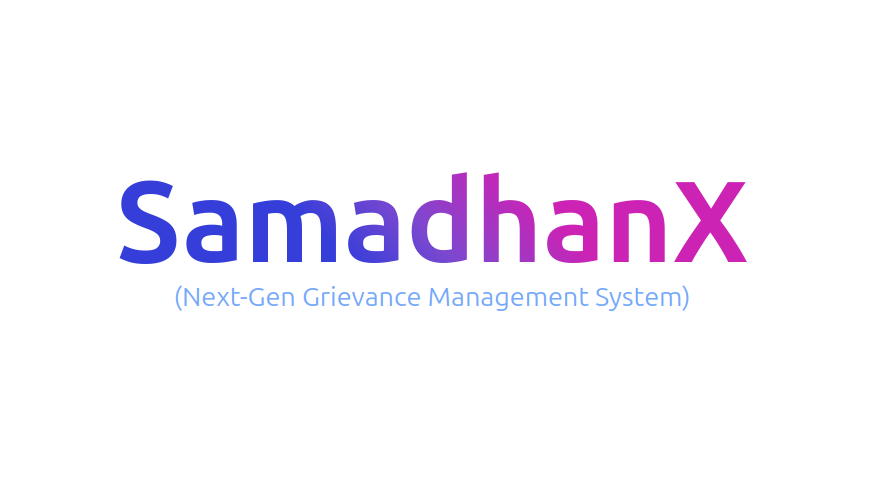

# SamadhanX (Next-Gen Grievance Management System)




# Overview

SamadhanX is an easy-to-use online platform that helps colleges manage student complaints more smoothly. It lets students file complaints in the right category, automatically sends them to the right person, and keeps everyone updated with real-time notifications to ensure quick and transparent resolution.


# 📋 Workflows

## 1. User Sign-In

- User (Student, Faculty, or Admin) accesses the portal and signs in.
- **On success:** Dashboard is loaded based on role.
- **On failure:** Error message shown with a retry option.

---

## 2. Complaint Creation

- User submits a complaint via the frontend.
- Backend actions:
  - Assigns it to an issue in-charge based on location.
  - Stores it in the `complaint` and `complaintOutbox` tables.
  - Publishes a `creation` event to PUB/SUB broker.
- WebSocket server:
  - Subscribed to `creation`, receives complaint ID.
  - Sends a trigger to the `complaintFeed` page in frontend.
- Frontend:
  - All users see a “New complaints” button.
  - Clicking shows the new complaints.

**Complaint Status:** `Assigned to incharge`  
**Failure (e.g. DB issue):** Error with retry option

---

## 3. Auto Escalation

- **Processor:**
  - Fetches all `PENDING` or `ASSIGNED` complaints from `complaintOutbox`.
  - Pushes them into a messaging queue.
- **Worker:**
  - Pulls complaints and escalates to higher authority.
  - Updates the `complaintAssignment` table.
  - Publishes an `escalation` event.
- **WebSocket server:**
  - Subscribed to `escalation`, sends trigger to `issueIncharge` page.
  - Complaint disappears from the old incharge’s dashboard and appears in the higher-ranked incharge’s dashboard.

---

## 4. Options for Issue Incharge

**Resolve by Self:**
- Marks complaint as resolved.
- Status: `Resolved`
- Notification sent to user for feedback.

**Delegate to Resolver:**
- Assigns complaint to a resolver.
- Status: `Delegated`
- Resolver gets notified.

**Escalate Complaint:**
- Moves complaint to higher level incharge.
- Status: `Assigned` at higher level.

---

## 5. Delegated Resolver Flow

- Resolver receives WhatsApp/SMS with complaint details.
- Works on complaint and submits resolution:
  - If resolver replies "yes" → Complaint status: `Resolved`
  - Notification sent to user for feedback.
- **If not resolvable:**
  - Escalated back to incharge.
  - Complaint reassessed.

---

## 6. User Feedback Phase

- Complaint marked `Resolved`, user gets confirmation option.
  - **If satisfied:** Status: `Closed`
  - **If not resolved:** Complaint is recreated or escalated.

---

## 7. Complaint Update by User

- Allowed while status is `PENDING` or `ASSIGNED`.
- Backend:
  - Updates `complaint` table.
  - Publishes an `updation` event.
- WebSocket:
  - Subscribed to `updation`, triggers update on incharge’s page.
- Incharge can see the updated complaint.

**Editable Fields:**
- Title
- Description
- Access
- PostAsAnonymous
- Tags
- Attachments  
**Note:** Location cannot be updated.


# Installation 
1. Clone the repository 
 ```
	https://github.com/CodeAnk2829/SamadhanX.git 
 ```
 2. Run `redis` container using docker
 ```
	docker run -p 6379:6379 -d redis
 ```
 > Follow the official link to download and install Docker on your machine:
 [https://docs.docker.com/get-started/get-docker/](https://docs.docker.com/get-started/get-docker/)
  3. Go to `./packages/db` folder and run migration command
```
	npx prisma migrate reset
```
> NOTE: Put your Postgres DATABASE_URL inside the `.env` file before you run migration.  
	   In case you want to run your database on your local machine, you can run it by using docker
	   - Start `Docker desktop` in case of Windows or Mac. You can use docker natively on Linux via your terminal
	   - Run the following command: `docker run -p 5432:5432 -e POSTGRES_PASSWORD=<your_password> -d postgres` and you are good to go.
4. Install `pnpm` on your machine
```
	npm install -g pnpm
```
5. Inside the root directory i.e. `/SamadhanX` run the following commands
```
	pnpm install 
	pnpm run build
```
> NOTE: if any error occurs at `build` then try running build command inside the following folders: `./apps/api`, `./apps/processor`, `./apps/worker` and `./apps/websocket`
6. After `build` run the servers
```	
	pnpm run dev
```
> Website is live at [http://localhost:5173/signup](http://localhost:5173/signup)
